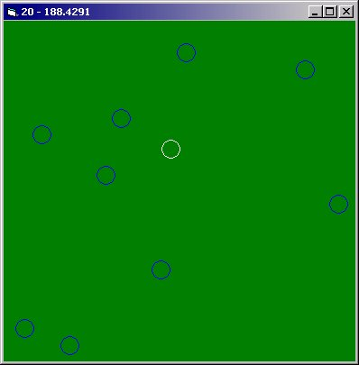



## Pool table physics

### Description

Circular collision detection using movement vectors. Does not have actual game rules but you use a cue ball to hit others and they react upon collisions including chain reactions. There are probably better ways of doing this, but I initially made this with something else in mind that did not turn out...
 
### More Info
 

             |
---                |---
**Submitted On**   |2004-09-12 00:30:42
**By**             |[Erik Stites](https://github.com/Planet-Source-Code/PSCIndex/blob/master/ByAuthor/erik-stites.md)
**Level**          |Intermediate
**User Rating**    |4.7 (28 globes from 6 users)
**Compatibility**  |VB 5\.0, VB 6\.0
**Category**       |[Games](https://github.com/Planet-Source-Code/PSCIndex/blob/master/ByCategory/games__1-38.md)
**World**          |[Visual Basic](https://github.com/Planet-Source-Code/PSCIndex/blob/master/ByWorld/visual-basic.md)
**Archive File**   |[Pool\_table1792349122004\.zip](https://github.com/Planet-Source-Code/erik-stites-pool-table-physics__1-56134/archive/master.zip)

